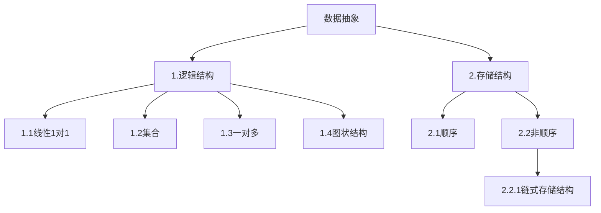
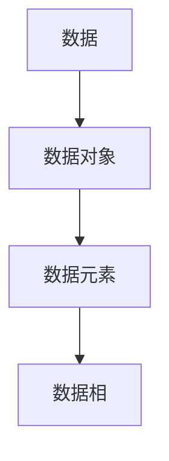

## 算法与数据结构
### 进行补课(C语言中的指针，结构题，结构体指针，动态内存管理)
《高级语言程序设计》->程序抽象
《数据结构》->数据抽象

课程类容
|线性表|
|栈和队列|
|字符串|
|数组和广义表|
|树和二叉数|
|图|
|查找|
|内部排序|
数据结构:
1.电话号码查询系统(字典)

2:图书馆的数目检索系统

3.计算级和人对弈

4.旅行商问题

5.井字棋对弈

6.田径赛的时间安排
### 基本概念
数据结构:研究数据的逻辑关系和物理关系,以及数据之间的相互关系,并在其上设计相关的算法

## 数据结构
### 第二章 线性表
#### 线性表的类型定义
n个顺序元素所组成的有限序列
第一个元素只有直接后继,中间元素有直接前趋和直接后趋,最后一个元素只有直接前继
2.1并集算法
$A = A \bigcup B$
算法
```c
viod union(List &La, List Lb){#注意这个地方有两个点，1在c中函数的变量引用的前面必须声明所引用的变量的类型，2此处的&La和Lb的引用,一个是引用传递(List &La) 一个是值传递(List Lb)引用传递可以在引用中更改原数据的变量，值传递不能在使用的过程中更改值的量，所进行运用的只是原始数据的一个备份
La_len = Listlength(La);
Lb_len = Listlength(Lb);
for(i = 1; i<=Lb_len;i++){
GetElem(Lb,i,e);
if(!LocateElem(La,e,equal))
Listinsert(La , ++La_len , e);#注意这个地方的插入只需要在表尾进行插入即可
}
}
```
以上的并集算法的算法复杂程度为O(n),因为在整个过程中只需要进行一次遍历Lb的循环
这个算法并不强调有序的概念，只要是LB中元素与LA中元素不同的元素，都会被加到LA中去
2.2归并有序算法(在并集的条件下再加入排序)
这个算法有一个严格的使用条件“本来的两个需要我们进行操作的表需要本来就是有序的”
$C = A \bigcup B$
归并有序算法要创造性的表，否则如果把表填充到A表中需要将后面的元素递归推动一位，这样十分的麻烦
算法思路
```c
void MergeList(List La,List Lb,List &Lc){
InitList(Lc);#由于我们要生成新的表，所以我们需要初始化以张新的表Lc
La_length = ListLength(La);
Lb_length = ListLength(Lb);
int i,j,k;
i=1;
j=1;
k=1;
int e,b;
while(i<=La_length&&j<=Lb_length){
GetElem(La,i,e);
GetElem(Lb,j,b);
if(e >= b){
ListInsert(Lc,k++,e);
i++;
}
else{
ListInsert(Lc,k++,b);
b++;
}
}
while(i<=La_length){
GetElem(La,i++,e);
ListInsert(Lc,k++,e);
}
while(j<=Lb_length){
GetElem(Lb,j++,b);
ListInsert(Lc,k++,b);
}
}
```
算法复杂程度为O(m+n);
这是顺序表算法中相当优秀的编码了
必须要记住条件为“所操作的两个表有着相同的递增或者递减的顺序表示”
#### 线性表的顺序表示和实现
数组也是循序表
对InitList的解析
```c
#define LIST_INIT_SIZE 100
#define LISTINCREMENT 10
typedef struct{
ElemType *elem;
int length;
int listsize;
}Sqlist;
```
把线性表的结点按逻辑顺序依次放在一组地址连续的储存单元内(顺序表)
$$LOC(a_(i+1) = LOC(a_(i) + I)$$
$$LOC(a_(i)) = LOCa_(1) + (i - 1)* I$$
## 结构初始化(创建顺序表)
```C++
Status Initlist_Sq(Sqlist &L){
L.elem = (ElemType *)malloc(LIST_INIT_SIZE*sizeof(ElemType)); #此处的ElemType指的是int , float这类的数据类型
#之所以要用ElemType是因为这不是完整代码，在全代码中，应该有“typedefine int ElemType”这类的代码，这样可以让这个代码之后的所有ElemType都是int，这样的好处是方便代码的优化的多样调用
if(!L.elem) exit(OVERFLOW);#在编程中，exit 是一个用于终止当前程序运行的函数（或语句），其核心作用是立即结束程序的执行，并返回一个状态码给操作系统。
L.length = 0;
L.listsize = LISt_INIT_SIZE;
return ok;
}
```
以上代码只是创建了一个空的顺序表(在c++中这串代码可以直接调用：InitList_Sq(L))
```c
Status InitList-Sq(SqList *L){
L->elem = (ElemType *)malloc(LIST_INIT_SIZE*sizeof(ElemType));
if(!L->elem) exit(OVERFLOW);
L->length = 0;
L->listsize = LIST_INIT_SIZE;
return OK;
}
```
以上代码是c中创建空顺序列表的代码(调用示例为：InitList_Sq(&La))
## 顺序表的插入和删除
顺序表的插入和删除都需要将操作元素之后的元素进行左移或者右移
### 插入
```c++
Status ListInsert_Sq(SqList &L, int i,ElemType e){
if(i<1||i>L.length+1) return ERROR;{#注意这个地方的i的限制可以取到L.length+1
newbase = (ElemType *)realloc(L.elem,(L.listsize+LISTINCREMENT)*sizeof(ElemType));
if(!newbase) exit(OVERFLOW);
L.elem = newbase; L.listsize += LISTINCREMENT;
}
ElemType *p;
p = &(L.elem[i-1]);
for(p = &(L.elem[L.length - 1]);p>=q;--p)
*(p + 1) = *p;
*q = e; ++L.length;
return OK;
}
```
算法复杂度为O(n)
c的源代码只是把Sqlist &L改成Sqlist *L，数据操作从方法操作(L.elem)改成指针操作(L->elem)
### 删除
```c++
Status ListDelet_Sq(Sqlist &L,int i,ELemType &e){
if((i<1)||(i>l.length)) return ERROR;
p = &(l.elem[i-1]);
q = L.elem + L.length - 1;#这个地方要理解L.elem表示的是L顺序表的基址(基址为L.elem[0]的地址)
for(++p;p<=q;++p){
*(p-1) = *p;
--L.length;
}
return OK;
}
```
算法复杂程度为O(n);
## 顺序表的查找
```c++
int LocateElem_Sq(Sqlist L,ElemType e,Status(*compare)(ElemType,ElemType)){
#注意此处我们对L表做的是值传递，而不是引用传递
i=1;
p = L.elem;
while(i<=L.length && !(*compare)(*(p++),e)) ++i;
if(i<=L.length) return i;
else return 0;
}
```
算法复杂程度为O(n)
#### 线性表的链式表示和实现
按照链接方式来分类
1.线性链表
2.循环链表
3.双向链表
按实现方式给分类
1.动态链表
2.静态链表
##### 线性链表
链表中节点的逻辑顺序和物理顺序不一定相同
线性链表中有一个头节点
这个节点可以空也可以储存该链表的长度
线性链表由节点构成，每个节点包含数据域和指针域
输出说明如下
```c
(*p) = LNode #*p 得到的是 p 所指向的整个节点（结构体变量），包含该节点的 data（数据域）和 next（指针域）两个成员。
p->data ((*p).data)#是访问了p节点的数据域
p->next ((*p).next)#是访问了p节点的指针域
```
## 创建线性链表
```c
typedef struct LNode{
ElemType data;
struct LNode *next;
}LNode,*LinkList;
LNode *p;
LinkList head;
```
```c
#线性链表(单链表)操作一览
GetElem_L(L,i,e)
ListInsert_L(&L,i,e)
ListDelet_L(&L,i,e)
ClearList_L(&L)#重置线性表为空表
CreateList_L(&L,n)#生成含有n个元素的链表
#以上除了第一个操作外，其他操作都需要对链表本身进行更改，所以是使用的引用取值
```
在数据结构中，随机存储结构（Random Access Structure） 是一种能通过元素的 “位置标识”（如索引）直接访问任意元素，且访问时间不随元素位置或数据量变化的存储方式。其核心特征是 “直接定位、常数时间访问”，区别于需按顺序遍历的 “顺序存储结构”（如链表）。
## 链表查找运算(GetElem_L(LinkList L,int i,ElemType &e)
不需要对L链表本身进行更改，所以是值传递，而对e需要改变其本身的值所以是引用传递(这些区别只在c++中有)
```c++
Status GetElem_L(LinkList L,int i,ElemType &e)
{
int j;
P = L->next;j = 1;
while(p && j<1){
P = P->next;j++;
}
if(!p || j>i)return ERROR;
e = p->data;
return OK;
}
p = (LNode*)malloc(sizeof(LNode));#p为动态变量，它是通过这个标准函数生成的
```
时间复杂程度为O(n)
## 链表的插入运算
```c++
Status LinkInsert_L(LinkList &L,int i,ElemType e){
p=L;j =0;
while(p&&j<i-1){
p = p->next;++j;
}#要在j处插入数，指针要先指到i处
h = (NLode*)malloc(sizeof(NLode));
h->data = e;
h->next = p->next;#需要注意此处的更改指针的顺序，由于要使用p->next所以一开始p->next不能被变动
p-next = h;
return OK;
}
```
时间复杂程度为O(n)
## 链表的删除运算
```c++
Status ListDelete_L(NLode &L,int i,ElemType &e){
p = L;
int j=0;
while(p&&j<i-1){
p = p->next;j++;
}
s = p->next;
p->next = s->next;#注意删除顺序
e = s->data;
free(s);
return OK;
}
```
## 建立单链表
1.头插法
这个方法有个弊端，就是生成的链表中的节点的次序和输入的顺序相反。
```c++
Status CreateList_L(ListLink &L,int n){
L = (LinkList)malloc(sizeof(LNode));
L->next = NULL;
for(i = n; i>0 ;--i){
 p = (LinkList)malloc(sizeof(NLode))
p->next = L->next;
scanf(&p->data);
L->next = p;
}
}
```
时间复杂度为O(n)
2.尾插法
我们希望生成链表中的节点的次序和输入的相同，则尾插法可以满足我们的需求
这个方法最大的不同是这个链表没有头节点，取而代之的是尾节点
```c++
Status CreateList_L(LinkList &L){
char ch;LNode *P, *r;
L=NULL; r=NULL;
while((ch = getchar())!='\n'{
p = (LNode *)malloc(sizeof(LNode));
p->data = ch;
if(L==NULL){L=p;r=p;}
else(r->next = p;r=p;)
}
if(r!=NULL){
r->next = NULL;
return OK;#最后补上空的尾指针
}
}
```
时间复杂程度为O(n)
## 有序链表的合并
思路和顺序链表的相同
##### 静态链表
可以用一维数组来描述链表(存储空间连续，存储逻辑不连续)
有头指针，指向链表第一个数据的数组下标，数据节点由数据域和游标域组成，最后一个数据节点的游标域指向0
```c++
#define MAXSIZE 1000 //链表的最大长度
typedef struct{
ElemType date;
int cur;
}component,SLinkList[MAXSIZE];
```
静态链表的查找--按照内容查找
```c++
int LocateElem_SL(SLinkList L,int s,ElemType e){
#s为头指针
i = L[s].cur;
while (i && L[i].data!=e)
i=L[i].cur;
return i;
}
```
##### 动态链表
##### 循环列表
##### 双向链表
#### 一元多项式的表示和相加
### 栈
先进后出
后进先出
### 队列
先进先出
### 串
#### 串的定义
#### 串的表示和实现
#### 串的模式匹配算法
##### kmp算法
####

# C++ 数据结构基础操作速查表

## 顺序表 (std::vector)
- **头文件**: `#include <vector>`
- **定义格式**: `std::vector<数据类型> 变量名;`
- **基础操作**:
  - 插入: `push_back(值)` (尾部插入), `insert(迭代器位置, 值)` (指定位置插入)
  - 删除: `pop_back()` (尾部删除), `erase(迭代器位置)` (指定位置删除)
  - 访问: `[索引]`, `at(索引)`, `front()` (首元素), `back()` (尾元素)
  - 其他: `size()` (元素个数), `empty()` (判空), `clear()` (清空)

## 链表 (std::list)
- **头文件**: `#include <list>`
- **定义格式**: `std::list<数据类型> 变量名;`
- **基础操作**:
  - 插入: `push_back(值)` (尾部插入), `push_front(值)` (头部插入), `insert(迭代器位置, 值)` (指定位置插入)
  - 删除: `pop_back()` (尾部删除), `pop_front()` (头部删除), `erase(迭代器位置)` (指定位置删除)
  - 访问: `front()` (首元素), `back()` (尾元素)
  - 其他: `size()` (元素个数), `empty()` (判空), `clear()` (清空), `sort()` (排序)

## 栈 (std::stack)
- **头文件**: `#include <stack>`
- **定义格式**: `std::stack<数据类型> 变量名;`
- **基础操作**:
  - 入栈: `push(值)`
  - 出栈: `pop()` (无返回值)
  - 访问栈顶: `top()`
  - 其他: `size()` (元素个数), `empty()` (判空)

## 队列 (std::queue)
- **头文件**: `#include <queue>`
- **定义格式**: `std::queue<数据类型> 变量名;`
- **基础操作**:
  - 入队: `push(值)`
  - 出队: `pop()` (无返回值)
  - 访问: `front()` (队头元素), `back()` (队尾元素)
  - 其他: `size()` (元素个数), `empty()` (判空)


