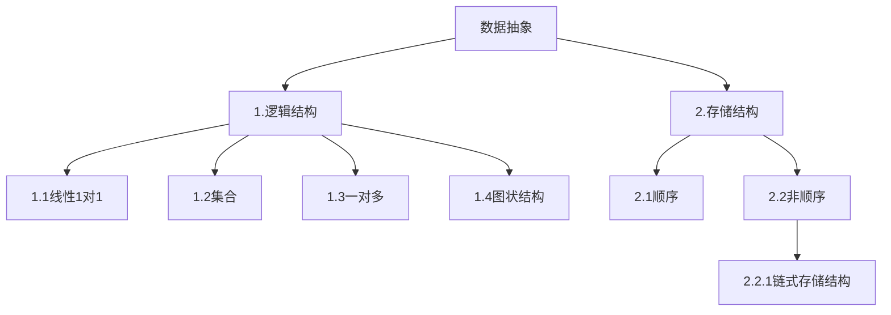
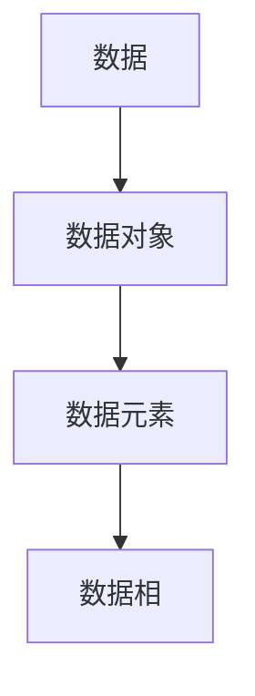

## 算法与数据结构
### 进行补课(C语言中的指针，结构题，结构体指针，动态内存管理)
《高级语言程序设计》->程序抽象
《数据结构》->数据抽象

课程类容
|线性表|
|栈和队列|
|字符串|
|数组和广义表|
|树和二叉数|
|图|
|查找|
|内部排序|
数据结构:
1.电话号码查询系统(字典)

2:图书馆的数目检索系统

3.计算级和人对弈

4.旅行商问题

5.井字棋对弈

6.田径赛的时间安排
### 基本概念
数据结构:研究数据的逻辑关系和物理关系,以及数据之间的相互关系,并在其上设计相关的算法

## 数据结构
### 第二章 线性表
#### 线性表的类型定义
n个顺序元素所组成的有限序列
第一个元素只有直接后继,中间元素有直接前趋和直接后趋,最后一个元素只有直接前继
2.1并集算法
$A = A \bigcup B$
算法思路
1.对B中的元素GetElem
2.if B.GetElem not in A
3.在A的最后 add B.GetElem

2.2归并有序算法
$A = A \bigcup B$
算法思路 "待完成"
#### 线性表的顺序表示和实现
3个基本数据
1.
把线性表的结点按逻辑顺序依次放在一组地址连续的储存单元内(顺序表)
$$LOC(a_(i+1) = LOC(a_(i) + I)$$
$$LOC(a_(i)) = LOCa_(1) + (i - 1)* I$$
结构初始化
```C
#define LIST_INIT_ SIZE 100
#define LISTINCREMENT 10
Ty
```
#### 线性表的链式表示和实现
按照链接方式来分类
1.线性链表
2.循环链表
3.双向链表
按实现方式给分类
1.动态链表
2.静态链表
##### 线性链表
##### 循环列表
##### 双向链表
####一元多项式的表示和相加
