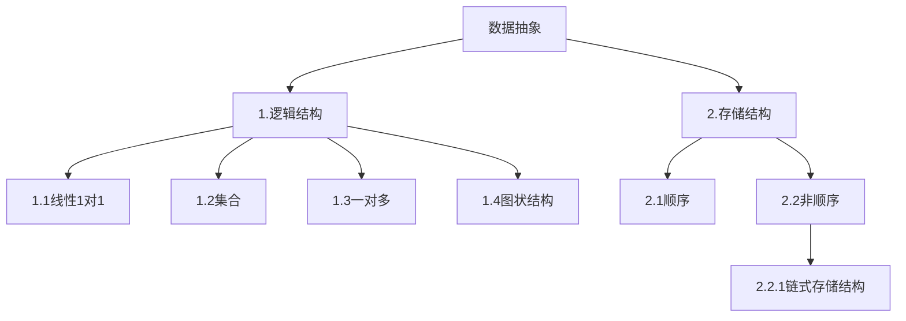
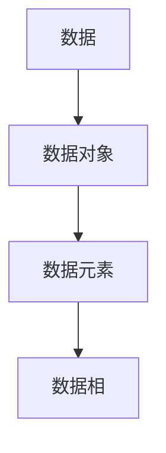

## 算法与数据结构
### 进行补课(C语言中的指针，结构题，结构体指针，动态内存管理)
《高级语言程序设计》->程序抽象
《数据结构》->数据抽象

课程类容
|线性表|
|栈和队列|
|字符串|
|数组和广义表|
|树和二叉数|
|图|
|查找|
|内部排序|
数据结构:
1.电话号码查询系统(字典)

2:图书馆的数目检索系统

3.计算级和人对弈

4.旅行商问题

5.井字棋对弈

6.田径赛的时间安排
### 基本概念
数据结构:研究数据的逻辑关系和物理关系,以及数据之间的相互关系,并在其上设计相关的算法

