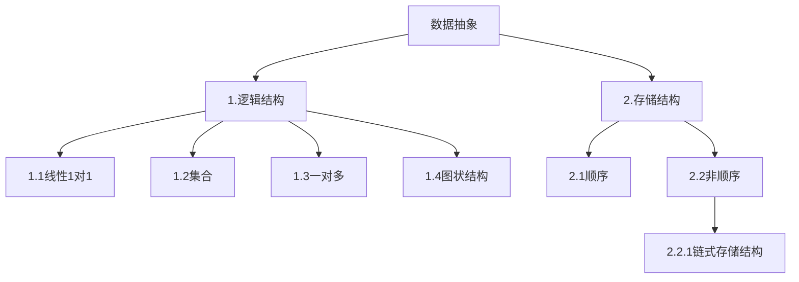
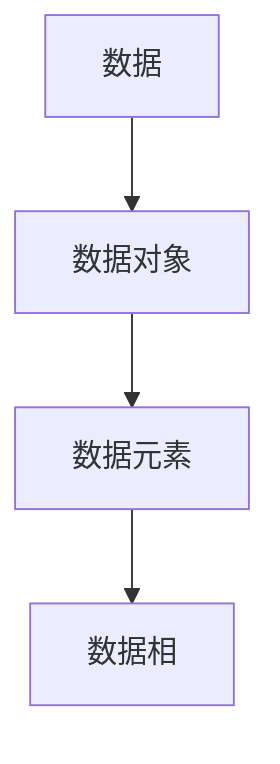

## 算法与数据结构
### 进行补课(C语言中的指针，结构题，结构体指针，动态内存管理)
《高级语言程序设计》->程序抽象
《数据结构》->数据抽象

课程类容
|线性表|
|栈和队列|
|字符串|
|数组和广义表|
|树和二叉数|
|图|
|查找|
|内部排序|
数据结构:
1.电话号码查询系统(字典)

2:图书馆的数目检索系统

3.计算级和人对弈

4.旅行商问题

5.井字棋对弈

6.田径赛的时间安排
### 基本概念
数据结构:研究数据的逻辑关系和物理关系,以及数据之间的相互关系,并在其上设计相关的算法

## 数据结构
### 第二章 线性表
#### 线性表的类型定义
n个顺序元素所组成的有限序列
第一个元素只有直接后继,中间元素有直接前趋和直接后趋,最后一个元素只有直接前继
2.1并集算法
$A = A \bigcup B$
算法
```c
viod union(List &La, List Lb){#注意这个地方有两个点，1在c中函数的变量引用的前面必须声明所引用的变量的类型，2此处的&La和Lb的引用,一个是引用传递(List &La) 一个是值传递(List Lb)引用传递可以在引用中更改原数据的变量，值传递不能在使用的过程中更改值的量，所进行运用的只是原始数据的一个备份
La_len = Listlength(La);
Lb_len = Listlength(Lb);
for(i = 1; i<=Lb_len;i++){
GetElem(Lb,i,e);
if(!LocateElem(La,e,equal))
Listinsert(La , ++La_len , e);#注意这个地方的插入只需要在表尾进行插入即可
}
}
```
以上的并集算法的算法复杂程度为O(n),因为在整个过程中只需要进行一次遍历Lb的循环
这个算法并不强调有序的概念，只要是LB中元素与LA中元素不同的元素，都会被加到LA中去
2.2归并有序算法(在并集的条件下再加入排序)
这个算法有一个严格的使用条件“本来的两个需要我们进行操作的表需要本来就是有序的”
$C = A \bigcup B$
归并有序算法要创造性的表，否则如果把表填充到A表中需要将后面的元素递归推动一位，这样十分的麻烦
算法思路
```c
void MergeList(List La,List Lb,List &Lc){
InitList(Lc);#由于我们要生成新的表，所以我们需要初始化以张新的表Lc
La_length = ListLength(La);
Lb_length = ListLength(Lb);
int i,j,k;
i=1;
j=1;
k=1;
int e,b;
while(i<=La_length&&j<=Lb_length){
GetElem(La,i,e);
GetElem(Lb,j,b);
if(e >= b){
ListInsert(Lc,k++,e);
i++;
}
else{
ListInsert(Lc,k++,b);
b++;
}
}
while(i<=La_length){
GetElem(La,i++,e);
ListInsert(Lc,k++,e);
}
while(j<=Lb_length){
GetElem(Lb,j++,b);
ListInsert(Lc,k++,b);
}
}
```
算法复杂程度为O(m+n);
这是顺序表算法中相当优秀的编码了
必须要记住条件为“所操作的两个表有着相同的递增或者递减的顺序表示”
#### 线性表的顺序表示和实现
数组也是循序表
对InitList的解析
```c
#define LIST_INIT_SIZE 100
#define LISTINCREMENT 10
typedef struct{
ElemType *elem;
int length;
int listsize;
}Sqlist;
```
把线性表的结点按逻辑顺序依次放在一组地址连续的储存单元内(顺序表)
$$LOC(a_(i+1) = LOC(a_(i) + I)$$
$$LOC(a_(i)) = LOCa_(1) + (i - 1)* I$$
## 结构初始化(创建顺序表)
```C++
Status Initlist_Sq(Sqlist &L){
L.elem = (ElemType *)malloc(LIST_INIT_SIZE*sizeof(ElemType)); #此处的ElemType指的是int , float这类的数据类型
#之所以要用ElemType是因为这不是完整代码，在全代码中，应该有“typedefine int ElemType”这类的代码，这样可以让这个代码之后的所有ElemType都是int，这样的好处是方便代码的优化的多样调用
if(!L.elem) exit(OVERFLOW);#在编程中，exit 是一个用于终止当前程序运行的函数（或语句），其核心作用是立即结束程序的执行，并返回一个状态码给操作系统。
L.length = 0;
L.listsize = LISt_INIT_SIZE;
return ok;
}
```
以上代码只是创建了一个空的顺序表(在c++中这串代码可以直接调用：InitList_Sq(L))
```c
Status InitList-Sq(SqList *L){
L->elem = (ElemType *)malloc(LIST_INIT_SIZE*sizeof(ElemType));
if(!L->elem) exit(OVERFLOW);
L->length = 0;
L->listsize = LIST_INIT_SIZE;
return OK;
}
```
以上代码是c中创建空顺序列表的代码(调用示例为：InitList_Sq(&La))
## 顺序表的插入和删除
顺序表的插入和删除都需要将操作元素之后的元素进行左移或者右移
### 插入
```c++
Status ListInsert_Sq(SqList &L, int i,ElemType e){
if(i<1||i>L.length+1) return ERROR;{#注意这个地方的i的限制可以取到L.length+1
newbase = (ElemType *)realloc(L.elem,(L.listsize+LISTINCREMENT)*sizeof(ElemType));
if(!newbase) exit(OVERFLOW);
L.elem = newbase; L.listsize += LISTINCREMENT;
}
ElemType *p;
p = &(L.elem[i-1]);
for(p = &(L.elem[L.length - 1]);p>=q;--p)
*(p + 1) = *p;
*q = e; ++L.length;
return OK;
}
```
算法复杂度为O(n)
c的源代码只是把Sqlist &L改成Sqlist *L，数据操作从方法操作(L.elem)改成指针操作(L->elem)
### 删除
```c++
Status ListDelet_Sq(Sqlist &L,int i,ELemType &e){
if((i<1)||(i>l.length)) return ERROR;
p = &(l.elem[i-1]);
q = L.elem + L.length - 1;#这个地方要理解L.elem表示的是L顺序表的基址(基址为L.elem[0]的地址)
for(++p;p<=q;++p){
*(p-1) = *p;
--L.length;
}
return OK;
}
```
算法复杂程度为O(n);
## 顺序表的查找
```c++
int LocateElem_Sq(Sqlist L,ElemType e,Status(*compare)(ElemType,ElemType)){
#注意此处我们对L表做的是值传递，而不是引用传递
i=1;
p = L.elem;
while(i<=L.length && !(*compare)(*(p++),e)) ++i;
if(i<=L.length) return i;
else return 0;
}
```
算法复杂程度为O(n)
#### 线性表的链式表示和实现
按照链接方式来分类
1.线性链表
2.循环链表
3.双向链表
按实现方式给分类
1.动态链表
2.静态链表
##### 线性链表
链表中节点的逻辑顺序和物理顺序不一定相同
线性链表中有一个头节点
这个节点可以空也可以储存该链表的长度
线性链表由节点构成，每个节点包含数据域和指针域
输出说明如下
```c
(*p) = LNode #*p 得到的是 p 所指向的整个节点（结构体变量），包含该节点的 data（数据域）和 next（指针域）两个成员。
p->data ((*p).data)#是访问了p节点的数据域
p->next ((*p).next)#是访问了p节点的指针域
```
## 创建线性链表
```c
typedef struct LNode{
ElemType data;
struct LNode *next;
}LNode,*LinkList;
LNode *p;
LinkList head;
```
```c
#线性链表(单链表)操作一览
GetElem_L(L,i,e)
ListInsert_L(&L,i,e)
ListDelet_L(&L,i,e)
ClearList_L(&L)#重置线性表为空表
CreateList_L(&L,n)#生成含有n个元素的链表
#以上除了第一个操作外，其他操作都需要对链表本身进行更改，所以是使用的引用取值
```
在数据结构中，随机存储结构（Random Access Structure） 是一种能通过元素的 “位置标识”（如索引）直接访问任意元素，且访问时间不随元素位置或数据量变化的存储方式。其核心特征是 “直接定位、常数时间访问”，区别于需按顺序遍历的 “顺序存储结构”（如链表）。
## 链表查找运算(GetElem_L(LinkList L,int i,ElemType &e)
不需要对L链表本身进行更改，所以是值传递，而对e需要改变其本身的值所以是引用传递(这些区别只在c++中有)
```c++
Status GetElem_L(LinkList L,int i,ElemType &e)
{
int j;
P = L->next;j = 1;
while(p && j<1){
P = P->next;j++;
}
if(!p || j>i)return ERROR;
e = p->data;
return OK;
}
p = (LNode*)malloc(sizeof(LNode));#p为动态变量，它是通过这个标准函数生成的
```
时间复杂程度为O(n)
## 链表的插入运算
```c++
Status LinkInsert_L(LinkList &L,int i,ElemType e){
p=L;j =0;
while(p&&j<i-1){
p = p->next;++j;
}#要在j处插入数，指针要先指到i处
h = (NLode*)malloc(sizeof(NLode));
h->data = e;
h->next = p->next;#需要注意此处的更改指针的顺序，由于要使用p->next所以一开始p->next不能被变动
p-next = h;
return OK;
}
```
时间复杂程度为O(n)
## 链表的删除运算
```c++
Status ListDelete_L(NLode &L,int i,ElemType &e){
p = L;
int j=0;
while(p&&j<i-1){
p = p->next;j++;
}
s = p->next;
p->next = s->next;#注意删除顺序
e = s->data;
free(s);
return OK;
}
```
## 建立单链表
1.头插法
这个方法有个弊端，就是生成的链表中的节点的次序和输入的顺序相反。
```c++
Status CreateList_L(ListLink &L,int n){
L = (LinkList)malloc(sizeof(LNode));
L->next = NULL;
for(i = n; i>0 ;--i){
 p = (LinkList)malloc(sizeof(NLode))
p->next = L->next;
scanf(&p->data);
L->next = p;
}
}
```
时间复杂度为O(n)
2.尾插法
我们希望生成链表中的节点的次序和输入的相同，则尾插法可以满足我们的需求
这个方法最大的不同是这个链表没有头节点，取而代之的是尾节点
```c++
Status CreateList_L(LinkList &L){
char ch;LNode *P, *r;
L=NULL; r=NULL;
while((ch = getchar())!='\n'{
p = (LNode *)malloc(sizeof(LNode));
p->data = ch;
if(L==NULL){L=p;r=p;}
else(r->next = p;r=p;)
}
if(r!=NULL){
r->next = NULL;
return OK;#最后补上空的尾指针
}
}
```
时间复杂程度为O(n)
## 有序链表的合并
思路和顺序链表的相同
##### 静态链表
可以用一维数组来描述链表(存储空间连续，存储逻辑不连续)
有头指针，指向链表第一个数据的数组下标，数据节点由数据域和游标域组成，最后一个数据节点的游标域指向0
```c++
#define MAXSIZE 1000 //链表的最大长度
typedef struct{
ElemType date;
int cur;
}component,SLinkList[MAXSIZE];
```
## 静态链表的查找--按照内容查找
```c++
int LocateElem_SL(SLinkList L,int s,ElemType e){
#s为头指针
i = L[s].cur;
while (i && L[i].data!=e)
i=L[i].cur;
return i;
}
```
时间复杂程度O(n)
## 初始化静态链表
```c++
void InitSpace_SL(SlinkList &space){
for(i = 0;i<MAXSIZE-1;++i)#0处不储存信息，开始遍历过一遍就跳过
space[i].cur = i+1;
space[MAXSIZE - 1].cur = 0;
}
```
静态链表实现时用户必须自己实现free和malloc两个函数
## 静态链表实现运算$(A-B)\bigcup(B-A)$
```c++
void difference(SLinkList &space,int &S){
InitSpace_SL(space);
S = Malloc_SL(space);
r = S;
scanf(m,n);
for(j = 1;j<=m;++j){
i = Malloc_SL(space);
scanf(space[i].data);
space[r].cur = i;r = i;
}
space[r].cur = 0;
for(j = 1;j<=n;++j){
scanf(b);
p = S;k = space[S].cur;
while(k! = space[r].cur && space[k].data!=b){
p = k;k = space[k].cur;
}
if( k == space[r].cur){
i = Malloc_SL(space);
space[i].data = b;
space[i].cur = space[r].cur;
space[r].cur = i;
}
else
space[p].cur = space[k].cur
Free_SL(space,k);
if(r == k)
r = p;
}
}
```
##### 动态链表
##### 循环列表
线性链表的尾指针指向头节点则为循环链表
##### 双向链表
线性链表的每一个节点不仅有指向下一个元素的指针还有指向上一个节点的指针
##### 双向循环链表
在双向链表的基础上头节点的头指针指向最后一个节点，尾节点的尾指针指向头节点

注意双向链表或者双向循环链表在插入或者删除的时候节点指针的删除顺序
#### 一元多项式的表示和相加
### 栈
栈是限制在表的一端机进行插入和删除运算的线性表，通常称插入，删除的这一端为栈顶，另一端为栈底
#### 栈的基本运算
构建栈(InitStack(&S))
判栈空(StackEmpty(s))
判栈满(StackFull(s))
插入(Push(&S,e))
1.入栈
2.进栈
3.压栈
删除(Pop(&S,&e))
1.出栈
2.弹栈
取栈顶(GetTop(S,&e))
### 顺序栈
由于栈是运算受限的线性表，因此线性表的存储结构对栈也适应

栈的顺序存储结构为顺序栈，由于其受限制于线性表，所以它可以用数组来表示顺序栈
## 顺序栈的类型定义
```c++
#define STACK_INIT_SIZE 100;
#define STACKINCREMENT 10;
typedef struct{
SElemType *base;
SElemType *top;
int stacksize;
}SqStack;
```
## 初始化栈
```c++
Status InitStack(SqStack &S){
S.base = (ElemType*)malloc(STACK_INIT_SIZE*sizeof(ElemType));
if(!S.bace) exit (OVERFLOW);
S.top = S.bace;
S.stacksize = STACK_INIT_SIZE;
return OK;
}
```
## 退栈
```c++
Status Pop(SqStack &S,SElemType &e){
if(S.top == S.base)return ERROR;
e = *--S.top;
return OK;
}
```
## 入栈
```c++
Stacus Push(SqStack &S,SElemType e){
if(S.top - S.bace >= S.stacksize){
S.base = (ElemType*)realloc(S.Bace,(S.stacksize + STACKINCREMENT) * sizeof(ElemType));#这个表示追加后的内存为这么多
if(!S.base) exit(OVERFLOW);
S.top = S.base + S.stacksize;
S.stacksize += STACKINCREMENT;
}
*S.top++=e;
return OK;
}
```
## 取栈顶(GetTop)
```c++
Status GetTop(SqStack S,SEleinType &e){
if(S.top == S.base)exit(ERROR);
e = *(S.top-1);
return OK;
}
```
### 链栈
### 栈的运用
1.数制转换
```c++
void conversion(){
initstack(s);
scanf('%d',n);
while(n){
push(s,n%8);
n = n/8;
}
while(!Stackempty(s)){
pop(s,e);
printf('%d',e);
}
}
```
2.括号匹配
```c++
Status matching(string& exp){
int state, i= 1, 1;
while(i<=Length(exp)&&state){
switch of exp[i]{case '(':{Push(S,exp[i]);i++;break;}
case')':{if(NOT StackEmpty(S)&&GetTop(S)='('){Pop(S,e);i++;}
    else{state = 0;}
break;}
}
}
if(StackEmpty(S)&&state)return OK;
```
3.行编程
```c++
while(ch!=EOF){
while(ch!=EOF&&ch!='\n'){
switch(ch){
case'#':Pop(S,c);break;
case'@':ClearStack(S);break;
default:Push(S,ch);break;
}
ch = getchar();
}
ClearStack(S);
if(ch!=EOF)ch = getchar();
}
```
4.迷宫求解
路径信息的保存
```c++
typedef struct{
int ord;#通道块在路径上的序号
PosType seat;#通道块在迷宫中的坐标
int di;从此通道块走向下下一个通道块的方向
}SELem Type;
```
迷宫求解的简单算法
```c++
Status MazePath(MazeType maze,PosType start,PosType end)
InitStack(S);curpos = start;
curstep = 1;
do{
if(Pass(curpos)){
Footprint(curpos);
e = (curstep,curpos,1);
Push(S,e);
if(curpos == end)return(TRUE);
curpos = NextPos(curpos,1);
curstep++;
}
else{
if(!StackEmpty(S)){
Pop(S,e);
while(e.di == 4&&!StackEmpty(S)){
MarkPrint(e.seat);Pop(S,e);
}
if(e.di < 4){
e.di++;Push(S,e);
curpos = NextPos(e.seat,e.di);
}
}
}
}
while(!StackEmpty(S));
return(FALSE);
}
```
5.表达式求值(运算符优先关系)
```C++
OperandType EvaluateExpression(){
InitStack(OPTR);push(OPTR,'#');
InitStack(OPTR);c = getchar();
while(c! = '#'||GetTop(OPTR)! = '#'){
if(!ln(c,OP)){Push(OPND,c);c = getchar();}
else
switch(Precede(GetTop(OPTR),c)){
case'<':Push(OPTR,c);c = getchar();break;
case'=':Pop(OPTR,x);c = getchar();break;
case'>':Pop(OPTR,theta);Pop(OPND,b);
Pop(OPND,a);Push(OPND,Operate(a,theta,b));break
}
}
return GetTop(OPND);
}
```
### 栈与递归
### 队列
队列(Queue)也是一种受限制的线性表，他只允许在表的一端进行插入，而在另一端进行删除(出队列)。允许删除的一端叫做队头(front)，允许插入的另一端叫做队尾(rear)
允许的运算为先进后出的线性表
抽象数据类型的队列定义
#### 队列的基本操作
```c++
InitQueue(&Q)    DestroyQueue(&Q)
QueueEmpty(Q)    QueueLength(Q)
GetHead(Q,&e)    ClearQueue(&Q)
EnQueue(&Q,e)    DeQueue(&Q,&e)
QueueTravers(Q,visit())
```
### 循环队列
为了克服一般队列储存空间利用率较少的情况，我们可以采用循环队列来对之前用过但是被删除的队列元素所占据的空间进行重复利用
```c++
# define MAXQSIZE 100
typedef struct{
QElemType *base;
int front;#头指针，若队列不空，指向队列头元素
int rear;#尾指针，若队列不空，指向队尾元素的下一个元素
}SqQueue;
```
```c++
#创建一个空的队列Q
Status InitQueue(SqQueue &Q)
{
Q.base = (ElemType*)malloc(MAXSIZE * sizeof(ElemType));
if(!Q.base)exit(OVERFLOW);
Q.front = Q.rear = 0;
return OK;
}
```
插入元素e为Q的新的队尾元素
```c++
if((Q.rear + 1)% MAXSIZE == Q.front)
return ERROR;
Q.base[Q.rear] = e;
Q.rear = (Q.rear + 1)%MAXSIZE;#这个地方体现了循环
return OK;
```
```c++
在队列中出一个元素
Status DeQueue(SqQueue &Q,ElemType &e){
if(Q.front == Q.rear)return ERROR;
e = Q.base[Q.front];#不用真正删除，只是将Q.front移开之后Q.rear就可以更改这个地方的数据了
Q.front = (Q.front + 1)% MAXSIZE;
return OK;
}
```
```c++
#返回Q的元素的个数,即队列的长度
int QueueLength(SqQueue Q)
{
return(Q.rear - Q.front + MAXSIZE)%MAXSZIE;
}
```
### 链队列
先进先出
```C++
typedef struct QNode{#节点类
QElemType data;
struct QNode *next;
}QNode;
typedef struct{#链队列类型
QNode *front;
QNode *rear;
}LinkQueue;
```
```c++
Status InitQueue(LinkQueue &Q){
#构造一个空的链队列
Q.front = Q.rear = (QNode *)malloc(sizeof(QNode));
if(!Q.front)exit(OVERFLOW);
Q.front->next = NULL;
return OK;
}
```
```c++
#销毁队列
Status DestroyQueue(LinkQueue &Q){
whlie(Q.front){
Q.rear = Q.front->next;
free(Q.front);
Q.front = Q.rear;
}
return OK;
}
```
```c++
#插入元素e为Q的新的队尾元素
Status EnQueue(LinkQueue &Q,QElemType e){
p = (QueuePtr)malloc(sizeof(QNode));
if(!p)exit(OVERFLOW);
p->data = e;p->next = NULL;
Q.rear->next = p;Q.rear = p;
return OK;
}
```
```c++
Status DeQueue(LinkQueue &Q,QElemType &e){
if(Q.front == Q.rear)return ERROR;
p = Q.front->next; e = p->data;
Q.front->next = p->next;
if(Q.rear == p)
Q.rear = Q.front;
free(p);
return OK;
}
```
### 串
串是0个或者多个字符(同等位置下，线性表的组成元素为数据元素，这个点为主要的区别)组成的有限序列

空串：串的长度为0的串为空串，不包含任何字符

空白串：由一个或者多个空格组成的串为空白串

### 串的基本概念
串中任意个连续的字符组成的子序列称为该串的子串,包含子串的串相应的称为主串
```c++
#串的基本操作
StrAssign(&T,chars)
DestroyString(&S)
StrCopy(&T,S)
StrLength(S)
StrCompare(S,T)
Concat(&T,S1,S2)
StrEmpty(S)
SubString(&S)
Index(S,T,pos)
Replace(&S,T,V)
StrInsert(&S,pos,T)
StrDelete(&S,pos,len)
```
#### 串的定义
串是0个或者多个字符(同等位置下，线性表的组成元素为数据元素，这个点为主要的区别)组成的有限序列
#### 串的表示和实现
#### 串的模式匹配算法
##### kmp算法
### 矩阵数据存储(多维数据存储)
### 树

# C++ 数据结构基础操作速查表

## 顺序表 (std::vector)
- **头文件**: `#include <vector>`
- **定义格式**: `std::vector<数据类型> 变量名;`
- **基础操作**:
  - 插入: `push_back(值)` (尾部插入), `insert(迭代器位置, 值)` (指定位置插入)
  - 删除: `pop_back()` (尾部删除), `erase(迭代器位置)` (指定位置删除)
  - 访问: `[索引]`, `at(索引)`, `front()` (首元素), `back()` (尾元素)
  - 其他: `size()` (元素个数), `empty()` (判空), `clear()` (清空)

## 链表 (std::list)
- **头文件**: `#include <list>`
- **定义格式**: `std::list<数据类型> 变量名;`
- **基础操作**:
  - 插入: `push_back(值)` (尾部插入), `push_front(值)` (头部插入), `insert(迭代器位置, 值)` (指定位置插入)
  - 删除: `pop_back()` (尾部删除), `pop_front()` (头部删除), `erase(迭代器位置)` (指定位置删除)
  - 访问: `front()` (首元素), `back()` (尾元素)
  - 其他: `size()` (元素个数), `empty()` (判空), `clear()` (清空), `sort()` (排序)

## 栈 (std::stack)
- **头文件**: `#include <stack>`
- **定义格式**: `std::stack<数据类型> 变量名;`
- **基础操作**:
  - 入栈: `push(值)`
  - 出栈: `pop()` (无返回值)
  - 访问栈顶: `top()`
  - 其他: `size()` (元素个数), `empty()` (判空)

## 队列 (std::queue)
- **头文件**: `#include <queue>`
- **定义格式**: `std::queue<数据类型> 变量名;`
- **基础操作**:
  - 入队: `push(值)`
  - 出队: `pop()` (无返回值)
  - 访问: `front()` (队头元素), `back()` (队尾元素)
  - 其他: `size()` (元素个数), `empty()` (判空)


