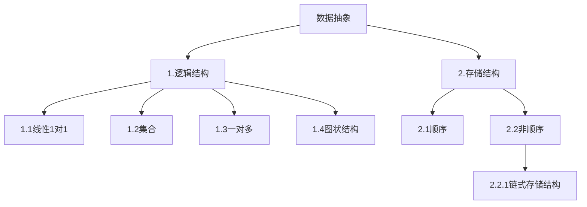
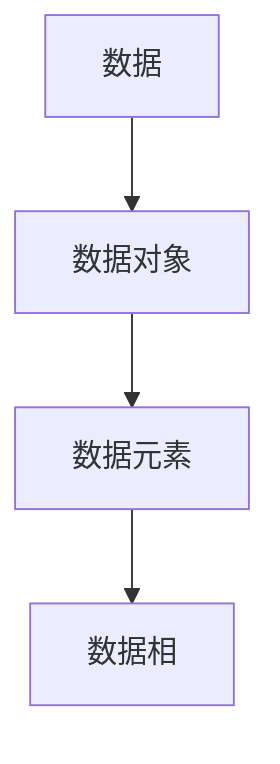

## 算法与数据结构
### 进行补课(C语言中的指针，结构题，结构体指针，动态内存管理)
《高级语言程序设计》->程序抽象
《数据结构》->数据抽象

课程类容
|线性表|
|栈和队列|
|字符串|
|数组和广义表|
|树和二叉数|
|图|
|查找|
|内部排序|
数据结构:
1.电话号码查询系统(字典)

2:图书馆的数目检索系统

3.计算级和人对弈

4.旅行商问题

5.井字棋对弈

6.田径赛的时间安排
### 基本概念
数据结构:研究数据的逻辑关系和物理关系,以及数据之间的相互关系,并在其上设计相关的算法

## 数据结构
### 第二章 线性表
#### 线性表的类型定义
n个顺序元素所组成的有限序列
第一个元素只有直接后继,中间元素有直接前趋和直接后趋,最后一个元素只有直接前继
2.1并集算法
$A = A \bigcup B$
算法思路
1.对B中的元素GetElem
2.if B.GetElem not in A
3.在A的最后 add B.GetElem

2.2归并有序算法
$A = A \bigcup B$
算法思路 "待完成"
#### 线性表的顺序表示和实现
3个基本数据
1.
把线性表的结点按逻辑顺序依次放在一组地址连续的储存单元内(顺序表)
$$LOC(a_(i+1) = LOC(a_(i) + I)$$
$$LOC(a_(i)) = LOCa_(1) + (i - 1)* I$$
结构初始化
```C
#define LIST_INIT_ SIZE 100
#define LISTINCREMENT 10
Ty
```
#### 线性表的链式表示和实现
按照链接方式来分类
1.线性链表
2.循环链表
3.双向链表
按实现方式给分类
1.动态链表
2.静态链表
##### 线性链表
##### 循环列表
##### 双向链表
####一元多项式的表示和相加
# C++ 数据结构基础操作速查表

## 顺序表 (std::vector)
- **头文件**: `#include <vector>`
- **定义格式**: `std::vector<数据类型> 变量名;`
- **基础操作**:
  - 插入: `push_back(值)` (尾部插入), `insert(迭代器位置, 值)` (指定位置插入)
  - 删除: `pop_back()` (尾部删除), `erase(迭代器位置)` (指定位置删除)
  - 访问: `[索引]`, `at(索引)`, `front()` (首元素), `back()` (尾元素)
  - 其他: `size()` (元素个数), `empty()` (判空), `clear()` (清空)

## 链表 (std::list)
- **头文件**: `#include <list>`
- **定义格式**: `std::list<数据类型> 变量名;`
- **基础操作**:
  - 插入: `push_back(值)` (尾部插入), `push_front(值)` (头部插入), `insert(迭代器位置, 值)` (指定位置插入)
  - 删除: `pop_back()` (尾部删除), `pop_front()` (头部删除), `erase(迭代器位置)` (指定位置删除)
  - 访问: `front()` (首元素), `back()` (尾元素)
  - 其他: `size()` (元素个数), `empty()` (判空), `clear()` (清空), `sort()` (排序)

## 栈 (std::stack)
- **头文件**: `#include <stack>`
- **定义格式**: `std::stack<数据类型> 变量名;`
- **基础操作**:
  - 入栈: `push(值)`
  - 出栈: `pop()` (无返回值)
  - 访问栈顶: `top()`
  - 其他: `size()` (元素个数), `empty()` (判空)

## 队列 (std::queue)
- **头文件**: `#include <queue>`
- **定义格式**: `std::queue<数据类型> 变量名;`
- **基础操作**:
  - 入队: `push(值)`
  - 出队: `pop()` (无返回值)
  - 访问: `front()` (队头元素), `back()` (队尾元素)
  - 其他: `size()` (元素个数), `empty()` (判空)

 # c的数据结构操作速查表
```c
#include <stdio.h>
#include <stdlib.h>

// 顺序表（基于数组实现）
#define SEQ_MAX_SIZE 100
typedef struct {
    int data[SEQ_MAX_SIZE];
    int length;
} SeqList;

// 顺序表操作函数
void initSeqList(SeqList *list) {
    list->length = 0;
}

int insertTail(SeqList *list, int value) {
    if (list->length >= SEQ_MAX_SIZE) return 0;
    list->data[list->length++] = value;
    return 1;
}

int insertPos(SeqList *list, int pos, int value) {
    if (pos < 0 || pos > list->length || list->length >= SEQ_MAX_SIZE) return 0;
    for (int i = list->length; i > pos; i--) {
        list->data[i] = list->data[i-1];
    }
    list->data[pos] = value;
    list->length++;
    return 1;
}

int deleteTail(SeqList *list) {
    if (list->length == 0) return 0;
    list->length--;
    return 1;
}

int deletePos(SeqList *list, int pos) {
    if (pos < 0 || pos >= list->length) return 0;
    for (int i = pos; i < list->length-1; i++) {
        list->data[i] = list->data[i+1];
    }
    list->length--;
    return 1;
}

int getElement(SeqList *list, int pos, int *value) {
    if (pos < 0 || pos >= list->length) return 0;
    *value = list->data[pos];
    return 1;
}

int getLength(SeqList *list) {
    return list->length;
}

int isEmpty(SeqList *list) {
    return list->length == 0;
}

void clearList(SeqList *list) {
    list->length = 0;
}

// 单链表
typedef struct Node {
    int data;
    struct Node *next;
} Node;

typedef struct {
    Node *head;
    int length;
} LinkList;

// 单链表操作函数
void initLinkList(LinkList *list) {
    list->head = NULL;
    list->length = 0;
}

int insertHead(LinkList *list, int value) {
    Node *newNode = (Node*)malloc(sizeof(Node));
    if (!newNode) return 0;
    newNode->data = value;
    newNode->next = list->head;
    list->head = newNode;
    list->length++;
    return 1;
}

int insertTail(LinkList *list, int value) {
    Node *newNode = (Node*)malloc(sizeof(Node));
    if (!newNode) return 0;
    newNode->data = value;
    newNode->next = NULL;
    
    if (list->head == NULL) {
        list->head = newNode;
    } else {
        Node *p = list->head;
        while (p->next != NULL) p = p->next;
        p->next = newNode;
    }
    list->length++;
    return 1;
}

int insertPos(LinkList *list, int pos, int value) {
    if (pos < 0 || pos > list->length) return 0;
    if (pos == 0) return insertHead(list, value);
    
    Node *p = list->head;
    for (int i = 0; i < pos-1; i++) p = p->next;
    
    Node *newNode = (Node*)malloc(sizeof(Node));
    if (!newNode) return 0;
    newNode->data = value;
    newNode->next = p->next;
    p->next = newNode;
    list->length++;
    return 1;
}

int deleteHead(LinkList *list) {
    if (list->head == NULL) return 0;
    Node *temp = list->head;
    list->head = list->head->next;
    free(temp);
    list->length--;
    return 1;
}

int deleteTail(LinkList *list) {
    if (list->head == NULL) return 0;
    if (list->head->next == NULL) {
        free(list->head);
        list->head = NULL;
    } else {
        Node *p = list->head;
        while (p->next->next != NULL) p = p->next;
        free(p->next);
        p->next = NULL;
    }
    list->length--;
    return 1;
}

int deletePos(LinkList *list, int pos) {
    if (pos < 0 || pos >= list->length) return 0;
    if (pos == 0) return deleteHead(list);
    
    Node *p = list->head;
    for (int i = 0; i < pos-1; i++) p = p->next;
    
    Node *temp = p->next;
    p->next = temp->next;
    free(temp);
    list->length--;
    return 1;
}

int getElement(LinkList *list, int pos, int *value) {
    if (pos < 0 || pos >= list->length) return 0;
    Node *p = list->head;
    for (int i = 0; i < pos; i++) p = p->next;
    *value = p->data;
    return 1;
}

int getLength(LinkList *list) {
    return list->length;
}

int isEmpty(LinkList *list) {
    return list->length == 0;
}

void destroyList(LinkList *list) {
    while (list->head != NULL) {
        Node *temp = list->head;
        list->head = list->head->next;
        free(temp);
    }
    list->length = 0;
}

// 栈（基于数组实现）
#define STACK_MAX_SIZE 100
typedef struct {
    int data[STACK_MAX_SIZE];
    int top;
} Stack;

// 栈操作函数
void initStack(Stack *stack) {
    stack->top = -1;
}

int push(Stack *stack, int value) {
    if (stack->top >= STACK_MAX_SIZE - 1) return 0;
    stack->data[++stack->top] = value;
    return 1;
}

int pop(Stack *stack, int *value) {
    if (stack->top == -1) return 0;
    *value = stack->data[stack->top--];
    return 1;
}

int getTop(Stack *stack, int *value) {
    if (stack->top == -1) return 0;
    *value = stack->data[stack->top];
    return 1;
}

int isEmpty(Stack *stack) {
    return stack->top == -1;
}

int isFull(Stack *stack) {
    return stack->top == STACK_MAX_SIZE - 1;
}

int getSize(Stack *stack) {
    return stack->top + 1;
}

// 队列（基于数组实现，循环队列）
#define QUEUE_MAX_SIZE 100
typedef struct {
    int data[QUEUE_MAX_SIZE];
    int front;
    int rear;
    int size;
} Queue;

// 队列操作函数
void initQueue(Queue *queue) {
    queue->front = 0;
    queue->rear = 0;
    queue->size = 0;
}

int enqueue(Queue *queue, int value) {
    if (queue->size >= QUEUE_MAX_SIZE) return 0;
    queue->data[queue->rear] = value;
    queue->rear = (queue->rear + 1) % QUEUE_MAX_SIZE;
    queue->size++;
    return 1;
}

int dequeue(Queue *queue, int *value) {
    if (queue->size == 0) return 0;
    *value = queue->data[queue->front];
    queue->front = (queue->front + 1) % QUEUE_MAX_SIZE;
    queue->size--;
    return 1;
}

int getFront(Queue *queue, int *value) {
    if (queue->size == 0) return 0;
    *value = queue->data[queue->front];
    return 1;
}

int getRear(Queue *queue, int *value) {
    if (queue->size == 0) return 0;
    int pos = (queue->rear - 1 + QUEUE_MAX_SIZE) % QUEUE_MAX_SIZE;
    *value = queue->data[pos];
    return 1;
}

int isEmpty(Queue *queue) {
    return queue->size == 0;
}

int isFull(Queue *queue) {
    return queue->size == QUEUE_MAX_SIZE;
}

int getSize(Queue *queue) {
    return queue->size;
}

// 示例用法
int main() {
    // 这里可以添加测试代码
    return 0;
}

```
